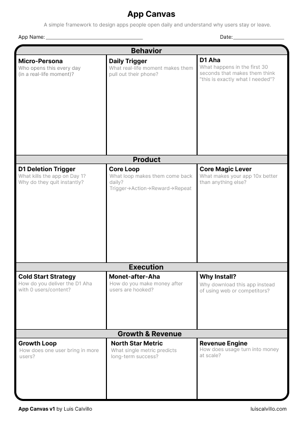

# App Canvas

App Canvas is a framework for building apps people open daily.

It was created to help founders, designers, and builders think beyond features and focus on the real drivers of retention: immediate value, habit loops, emotional pull, and repeat use.

## Why App Canvas

Most apps do not fail because the idea is bad.  
They fail because users do not come back.

App Canvas is designed to help you think through the parts of an app that actually matter for long-term usage.

## Who it's for

- founders
- indie hackers
- product designers
- app developers
- startup teams

## What it helps you define

- the Day-1 aha moment
- the repeat-use trigger
- the core loop
- the emotional pull
- the long-term value

## Preview

## Download

- [Download the PDF](pdf/app-canvas.pdf)

## Read the full article

- [The App Canvas article](https://luiscalvillo.com/the-app-canvas-a-framework-for-building-apps-people-open-daily/)

## Created by

Luis Calvillo

## License

This project is shared openly so others can learn from it, use it, and build on it with attribution.
